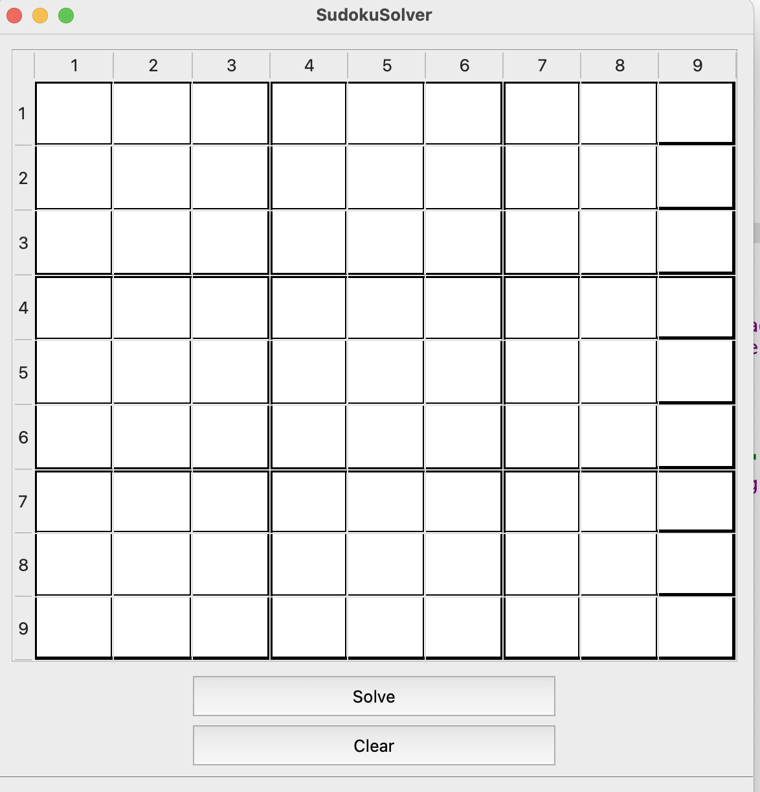
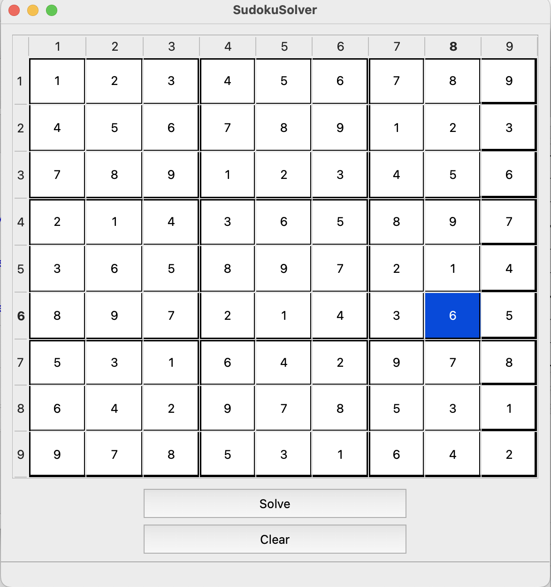
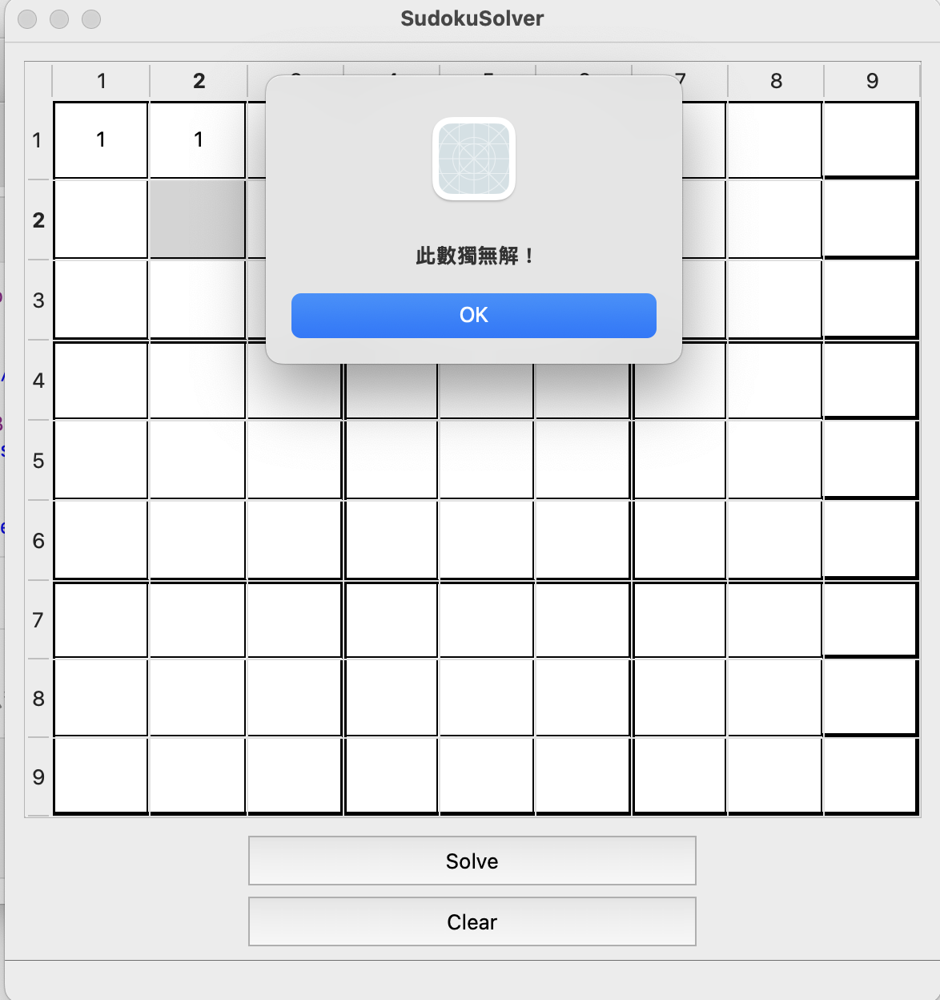

# 🧩 Sudoku Solver (Qt GUI Version)

This is a Sudoku solver application built with the Qt framework. It provides a user-friendly graphical interface for inputting Sudoku puzzles and solving them with a single click. The app also supports board clearing and shows a message box if the puzzle is invalid or unsolvable.

## 📸 Features

- 9x9 Sudoku input grid
- **Solve** button: Automatically solves the puzzle using backtracking
- **Clear** button: Clears the entire board
- Error detection: Invalid or unsolvable puzzles will show a warning popup

## 🖼 Screenshots

### 🔹 Initial Interface


### 🔹 Solved Board


### 🔹 Invalid Input

## 🛠 Tech Stack

- C++
- Qt 6 (Widgets)
- Backtracking algorithm for solving Sudoku

## 📦 How to Build & Run

1. Make sure you have [Qt](https://www.qt.io/download) installed (Qt 6 recommended)
2. Open the `.pro` file or `CMakeLists.txt` in **Qt Creator**
3. Build and run the project

Alternatively, using terminal:

```bash
qmake
make
./Sudoku

